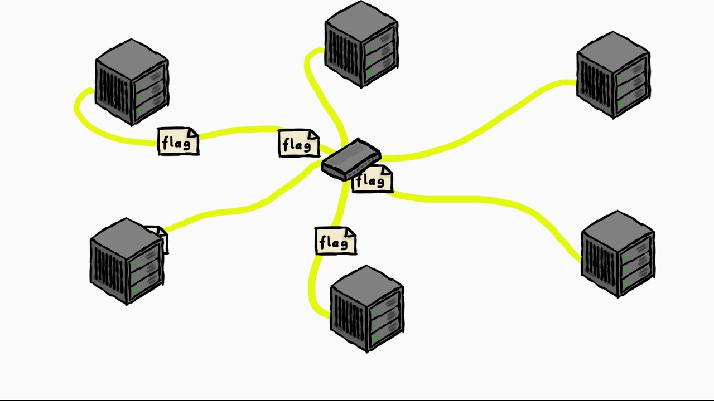
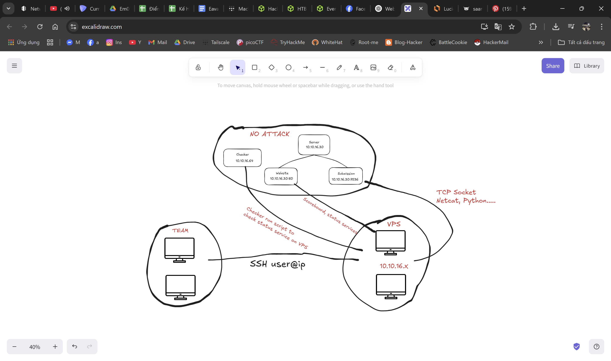

# README

**Attack-Defense (AD)** is a dynamic and strategic style of **Capture The Flag (CTF)** competition where teams must both defend their own services and attack those of other teams.

During the competition, each team is assigned vulnerable services that they must:

* Maintain and secure, ensuring the service remains up and flags are accessible.
* Exploit vulnerabilities in other teams' services to capture flags and gain points.
* Prevent other teams from exploiting their own services.

 

## A. Server

### 1. Tick and Flag Generation

* At the start of each tick, the server generates a new flag for each team's service. Controller will is service responsible generates flag.
* Flag generation is based on a specific import function defined by the service.
* After generating the flag, the server attempts to import (store) the flag into the service.
* If the service returns the correct flag when queried, the import is considered successfull.

### 2. Flag Checking and Service Status

* Once the flag is imported, the tick is further divided into smaller intervals, such as 5 seconds or 10 seconds, during which the system periodically checks the service.
* In each check:
  * The system queries the service for the current flag.
  * If the service responds with the correct flag, it is considered OK.
  * If the service fails to respond, returns an incorrect flag, or cannot be checked, the service is marked as "down" for that tick.
* After a ticks, if service is marked as OK, the team will awarded points SLA  and vice versa the team will lose points SLA if service is marked as down. 

### 3. Auxiliary function

* If auxiliary function as login, authentication is not activity or activity but is't not true, service is marked as down.
* If response status to service is 400, 401, 403, 500…, service is marked as down.

### 4. Submission

* Server will always listen tcp on a port e.g 7217 to allow the team can netcat, or open tcp to can submission flag.
* Flag will verify to step by step:
  * Flag is true format.
  * IP open submission should VPS have services.
  * Flag is not owner team.
  * Flag don't exprise
  * Flag only can submitted once.
* When one team submission successfully, the team submission will  awarded points Attack, but team had flag submitted will lose points. 

## B. Team 

### 1. VPS and Service

* Each team will  distributed a VPS, it's Ubuntu can 20.04 or 22.04. Depending on the competition, player should Privilege Escalation on root, or user have higher permission. 
*   Service can builed base service on Linux, or Docker. Which can web, reverse, or pwnable.
*   Each service have any vuln to the comptitor can exploit.
*   Team should exploit their service, after run POC to can exploit the comptitor services and patch vuln of their service.

### 2. Submission

* The team should ssh to their VPS by key or username:password to can submission.
* Only submission will can submission each flag once.

### 3. Status serivice and config firewall

* Team must be careful when reseting their services. If services is DOWN, team will lose points SLA.
* Can use patch file to fix or modify binary and modify code directly and restart services.
* Team should not block traffic competitor team to who is not exploit.

 